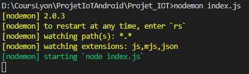

# API REST objet connecté
Ce projet est un développement d'une API REST pour la communication entre un objet connecté, une base de données et une application mobile Android.

## API
### Langage
L'API a été développée en Node.js et utilise Express comme serveur. Elle fait appel à une base de données MongoDB.
### Prérequis
Avoir installer mongoDB, Node.js et npm
### Installation et lancement
<ul>
  <li>Cloner le projet</li>
  <li>Se placer à la racine du projet (/nom_du_proj)</li>
  <li>Executer la commande suivante pour installer le projet : </li>
  
  ```
  npm install 
  ```
  <li>Puis : </li>
  
  ```
  node index.js ou nodemon index.js 
  ```
  Le serveur est lancé.
  
</ul>


End with an example of getting some data out of the system or using it for a little demo

### Running the tests

Explain how to run the automated tests for this system


Le code pour l'objet connecté est disponible dans le dossier /ESP32 à la racine du projet.
